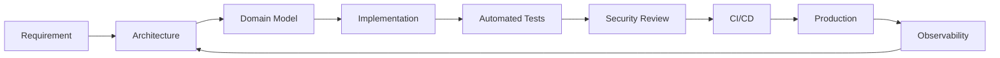

<div align="center">

# ZAKI MUHAMAD FADILAH - KANG KETIK KETIK

### Full\-Stack Software Engineer · Systems Builder · Product Engineering

Building reliable digital products across frontend, backend, cloud, automation, and platform engineering\.

[](https://github.com/ZAKI-MUHAMAD-FADILAH)
[](https://github.com/ZAKI-MUHAMAD-FADILAH)

</div>

---

## Engineering Profile

I am a **Full\-Stack Software Engineer** focused on designing and shipping production\-ready web applications, internal platforms, SaaS products, APIs, automation workflows, and cloud\-connected systems\.

My engineering approach emphasizes:

- **Clean Architecture** and clear separation of concerns
- **SOLID**, modularity, maintainability, and testability
- **Security by Design** with least privilege and defensive defaults
- **Performance Engineering** across client, server, database, and edge
- **Reliable Delivery** through CI/CD, observability, and automated quality gates
- **Product Thinking** — engineering decisions should support measurable business outcomes

> I prefer systems that are understandable under pressure, secure by default, and scalable without premature complexity.

---

## Core Engineering Stack

### Frontend

<p>
  
</p>

**Primary:** Next\.js · React · TypeScript · Tailwind CSS
**UI Engineering:** Component systems · Responsive design · Accessibility · Performance optimization · Design systems

### Backend & Data

<p>
  
</p>

**Primary:** Node\.js · Python · PostgreSQL · Supabase · Redis
**Practices:** REST APIs · AuthN/AuthZ · RLS · Transactional workflows · Caching · Rate limiting · Idempotency

### Cloud, Platform & Delivery

<p>
  
</p>

**Platform:** Vercel · Cloudflare · Docker · GitHub Actions
**Focus:** CDN/WAF · CI/CD · environment isolation · secrets management · deployment safety · observability

### Mobile & Cross\-Platform

<p>
  
</p>

Kotlin · Swift · PWA/TWA · Mobile\-first web architecture

---

## Architecture Principles

```text
Domain First
├── Business rules remain independent
├── Infrastructure is replaceable
├── Interfaces define boundaries
├── Side effects are isolated
└── Tests validate behavior, not implementation
```

I generally prefer a **modular monolith** for early\-to\-mid stage products and only introduce distributed architecture when operational or scaling requirements justify the added complexity\.

### Production Baseline

```yaml
architecture:
  principles:
    - clean-architecture
    - solid
    - dependency-inversion
    - domain-boundaries
    - contract-driven-design

security:
  baseline:
    - input-validation
    - parameterized-queries
    - least-privilege
    - secure-session-management
    - rate-limiting
    - audit-logging
    - secret-isolation

quality:
  gates:
    - lint
    - typecheck
    - unit-test
    - integration-test
    - build
    - security-review

operations:
  requirements:
    - structured-logging
    - health-checks
    - error-tracking
    - metrics
    - rollback-strategy
```

---

## What I Build

|Domain         |Capability                                                  |
|---------------|------------------------------------------------------------|
|Web Platforms  |Marketing sites, portals, dashboards, internal tools        |
|SaaS           |Multi-tenant applications, subscriptions, customer portals  |
|Backend Systems|APIs, business logic, integrations, background jobs         |
|Commerce       |Checkout, payment flows, invoicing, transaction workflows   |
|Automation     |Workflow orchestration, AI-assisted operations, integrations|
|Enterprise Apps|Role-based systems, audit trails, operational platforms     |
|Data           |PostgreSQL modeling, RLS, caching, analytics pipelines      |
|Platform       |Edge security, CI/CD, deployment workflows, observability   |

---

## Security Engineering Mindset

Security is treated as an engineering requirement, not a post\-release checklist\.

```text
Client
  ↓
Edge Protection
  ↓
Application Validation
  ↓
Authorization Boundary
  ↓
Domain Logic
  ↓
Data Access Policy
  ↓
Audit / Observability
```

Typical controls include **schema validation**, **RBAC/RLS**, **rate limiting**, **idempotency**, **WAF**, **CSRF/XSS defenses**, **secure headers**, **secret isolation**, and **structured audit logs**\.

---

## Engineering Workflow



---

## Current Focus

- Full\-stack product engineering with **Next\.js \+ TypeScript**
- PostgreSQL\-backed applications with strong authorization boundaries
- Cloud\-native deployment and edge security
- AI\-assisted business automation and workflow orchestration
- Production\-grade developer experience, testing, and CI/CD
- Building maintainable systems that can grow from MVP to enterprise workloads

---

## GitHub Engineering Metrics

<div align="center">


</div>

<div align="center">


</div>

> GitHub statistics are generated by third-party public widgets and may be temporarily unavailable because of rate limits or provider outages.

---

## Engineering Values

**Build for clarity\.** Clever code has a maintenance cost\.

**Design for failure\.** Networks fail, dependencies time out, users retry, and systems must remain consistent\.

**Measure before optimizing\.** Performance work should be driven by data\.

**Security is architectural\.** Authorization, validation, isolation, and auditability should exist by design\.

**Ship with discipline\.** A feature is not production\-ready until it can be tested, observed, operated, and safely changed\.

---

## Contact

<div align="center">

**Zaki Muhamad Fadilah**
Full\-Stack Software Engineer

[](mailto:zaki.muhamad@zackpratama.tech)
[](https://github.com/ZAKI-MUHAMAD-FADILAH)

</div>

---

<div align="center">

### ENGINEERED FOR RELIABILITY · DESIGNED FOR SCALE · BUILT TO SHIP

<sub>© 2026 Zaki Muhamad Fadilah · Personal Engineering Profile</sub>

</div>
